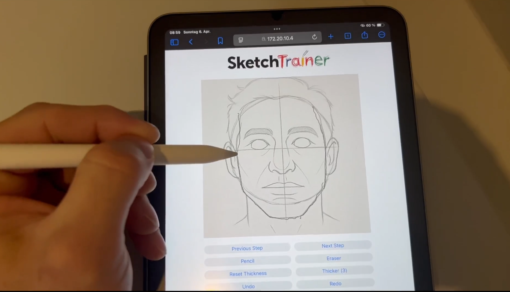
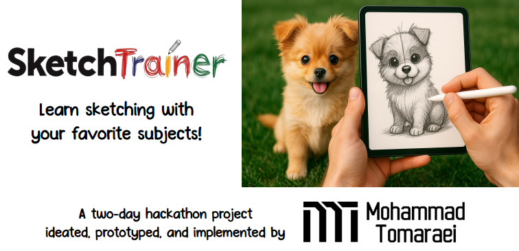
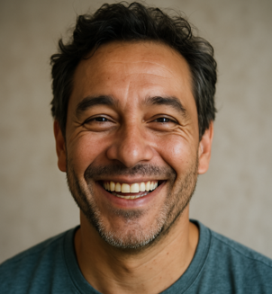
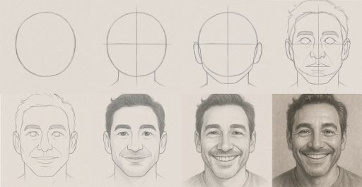

# SketchTrainer

Learn sketching with your favorite subjects!

## [Video Demo](https://www.youtube.com/watch?v=opLZGOT147Y)

## [Presentation Slides](presentation/sketchtrainer-presentation.pdf)

## What is SketchTrainer?

- Helps you learn how to sketch and draw
- Step-by-step from basic shapes to final drawing
- AI generated sketch and steps
- Based on an image of your favorite subject
- Boosts your learning motivation

## Motivation

- It’s a fun and useful idea!
- Up until recently, sketch generation = edge detection
- What’s new? SOTA!
  - OpenAI - ChatGPT 4o Image Generation
    - Image manipulation with attention to prompt details
    - Style transfer with great character consistency
  - Black Forest Labs - FLUX Redux
    - Image variation generation
    - Style transfer with character consistency

## How does SketchTrainer work?

- Choose an image of your favorite subject
- The AI generates the steps from basic shapes to the complete sketch and drawing
- Each step serves as a tracing guide (you draw on top)
- Whenever you’re ready, move on to the next step
- Every step adds a little bit more detail – feel free to erase and
  adjust!
- Everything you see was purely done with prompting!

### Subject

This image was generated by ChatGPT 4o with the prompt “Generate a photorealistic 
portrait of an imaginary but happy person."

### Steps

## Prompt Engineering

The current MVP prompts are designed for drawing the portrait of a person.
However, they could easily be auto-generated for any use case by providing 
a template and asking ChatGPT to automatically infer the type of subject
and adapt the steps.

### Initial Prompt

> You are going to generate a series of steps on how to sketch a person's portrait, starting from a basic shape, and ending with a complete sketch. Each step should add more detail, based on the description that I will provide, 
  but all the steps are part of the ultimate sketch of the person's portrait. For each step, I will tell you the description of what you should draw. Make sure to strictly follow the description provided, with the only adjustment
  being that it should be on the subject that I want to draw. I will also provide the photo of the subject I want to draw, so you generate your drawing with the subject in mind. But remember that the amount of detail should be exactly 
  as in the description of the step. Make sure that what you draw is in the same head position and direction as in the subject's photo. At every step, remember what you have drawn so far, and keep your focus on the final sketch. 
  Here is the photo of the subject. I will next give you the first step.

### Step Prompts

> This is the first step. Draw a circle corresponding to the head of the subject. Here's an example of what you should draw. Remember that it should be based on the subject I showed you.

> This is the second step. Draw a vertical and horizontal line to represent the width of the face and height of the head to neck. Remember that it should be based on the subject I showed you.

> This is the third step. Draw a very rough and simple outline of the ears, connecting to the jawline, and a vertical line to correspond to the position of the nose. Remember that it should be based on the subject I showed you.

> This is the fourth step. Draw circles representing the location and rough shape of the eyes, sketch the rough shape of eyebrows, the rough shape of the nose with simple lines, and the basic structure of the lips and the jaw. Draw a very basic outline of the hairline and few lines outside the circle to represent the amount of hair. Remember that it should be based on the subject I showed you.

> This is the fifth step. Erase the basic circles and lines. Connect the structures already drawn to create a basic cohesive outline of the portrait, but just a rough outline. Add a rough outline of the amount and shape of the hair. Remember that it should be based on the subject I showed you.

> This is the sixth step. Draw light shadows to represent and fill in the hair, very lightly. Lightly fill in the eyebrows, the pupils, and the lips. Remember that it should be based on the subject I showed you.

> This is the seventh step. Draw other detailed facial structures and add light shadows to add depth and add details to facial structures like more details to ears, nose, lips, eyes, etc. Remember that it should be based on the subject I showed you.

> This is eight and last step. Add any remaining details, but not too much, to complete the sketch of the person's portrait. Add shadows to represent the skin color and details of the hair. Remember that it should be based on the subject I showed you.

## How to use it?

- You'd need access to [ChatGPT 4o Image Generation](https://openai.com/index/introducing-4o-image-generation/)
  - A free account is limited to only a few requests a day
  - A ChatGPT Plus membership is more feasible
  - At the time of writing (April 6, 2025), there is [no official API access yet](https://community.openai.com/t/api-for-image-generation-for-gpt-4o-model/1153132/13)
    > Developers will soon be able to generate images with GPT‑4o via the API, with access rolling out in the next 
      few weeks.
  - Until this API becomes available, this project is using pre-generated images based on prompts below 
    (the files can be found in the `images` directory)
- Once the images have been generated, the user could either import them into their favorite drawing app or use the
  provided web-based drawing app
  - To start the app, simply navigate to the `app` directory, run `npm install`, `npm run dev`, and open
    the application in your device of choice (e.g. an iPad also connected to the same network)

## Next features?

- Implement an actual iOS app with PencilKit (Apple Pencil)
- Generate a sketch in any style you want
  - Studio Ghibli, Renaissance, Caricature, etc.
- Customize the steps
  - Skip basic steps or add more steps
  - Focus on details you want to learn (e.g. shadows)
- Regenerate step variations based on what you’ve drawn
- Learn “step prompts” from human-made drawing tutorials
- Sky is the limit

### Disclaimer

All images (except the Mohammad Tomaraei logo) are AI generated (via ChatGPT 4o) and are strictly for educational purposes